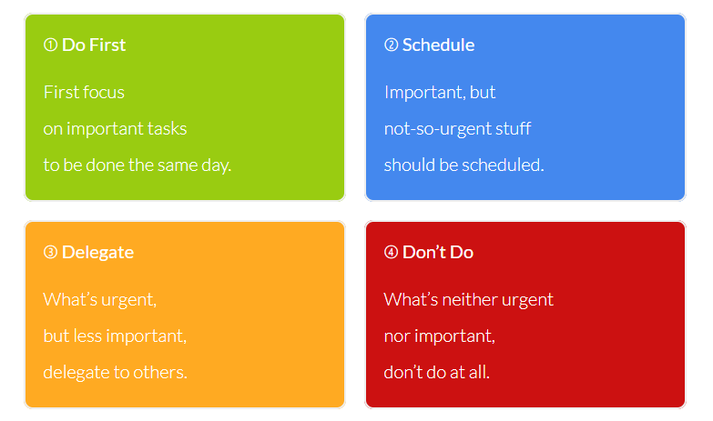

Zawsze przychodzi taki moment w ciągu tygodnia, że najlepiej rzucić by to wszystko i wyjechać w bieszczady.
Bardzo rzadko jednak bieszczady same przychodzą ;) Najpierw trzeba je sobie zaplanować - i tutaj wygrywa wewnętrzny leń.

Co zatem zrobić, żeby pozbyć się wewnętrznego lenia i zaczać robić fajne rzeczy?

Najlepszym rozwiązaniem jest stworzenie nawyku który będzie cie na tyle zmuszał do robienia rzeczy, że będziesz to robić z automatu.

U mnie idealnym do tego narzędziem był todoist.

Todoist to miejsce w którym trzymam wszystkie akcje które muszę/chcę wykonać.

## KROK PIERWSZY
Krok pierwszy jest prosty w zrozumieniu, trudny w wykonaniu. 

> **Zacznij to robić**

Chyba nie muszę się rozpisywać o ile ważniejsze od wybierania metody robienia, jest samo rozpoczęcie działana. 
Jeśli nie przekonały Cię moje słowa, to zapraszam do Krzysztofa Gonciarza, który ten element tłumaczy bardziej marketingowo :) 

OBEJRZYJ -> [📽 KROK PIERWSZY](https://www.youtube.com/watch?v=LXM_tGHcuMo)

## Zbieranie zadań/myśli

Zacznij zapisywać wszystkie swoje zadania w jednym miejscu. Czy to będzie kartka, czy to narzędzie do notatek - nieważne. Jeśli ci się nie spodoba, zmienisz je po jakimś czasie na lepsze. Najważniejsze, by zawsze było gotowe do oglądania i dodawania nowych wpisów.

Do tego celu osobiście używam skrzynki odbiorczej Todoist.
To narzędzie idealne dla człowieka posiadającego telefon zawsze przy sobie.
W todoist mamy skrót do dodania zadania wszędzie w systemie Android/iOS - ten przycisk jest zawsze dostępny na ekranie startowym albo w pasku powiadomień!

## Review

Kiedy stwierdzamy, że zadanie powinno zostać wykonane w konkretnej kolejności?
Do tego może nam pomóc Matryca Eisenhowera, która zakłada rodzielenie zadań na 2 kwadraty.

Dla mnie jest to rozwiązanie zbyt skomplikowane. Mi osobiście wystarczy rozdzielenie per priorytet. Dzięki temu wiem co jest ważne a co nie.

// TODO Przypisywanie zadań do projektów