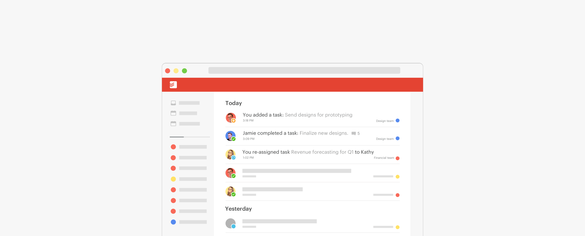
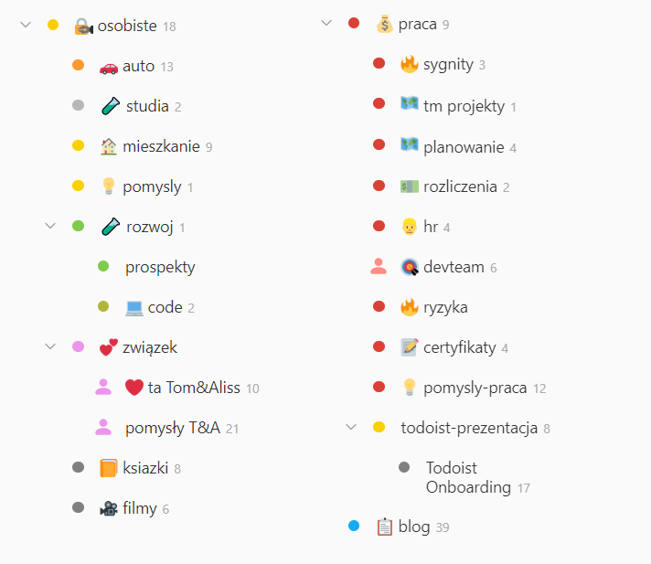
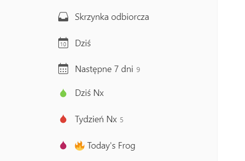

### Cześć i czołem programistyczne freaki ;)

Dzisiejszym tematem, który weźmiemy na tapet jest Todoist. Todoist to przepiękna, darmowa aplikacja na wszystkie urządzenia służąca za niezastąpione narzędzie do GTD (Getting Things Done) -  kto nie słyszał zapraszam do prezentacji Macieja Aniserowicza https://www.youtube.com/watch?v=2-f1z5uvZxQ.

Jeśli to czytasz, to jestem w trakcie tworzenia posta na temat tego w jaki sposób roczpoczać przygodę w produktywnym świecie właśnie z narzędziem klasy todoist.

## Mój todoist setup 2019

Lista projektów:

Dashboard:

Jak widać nie mam zbyt wielu zadań zaplanowanych na ten tydzień.
Proces planowania zwykle następuje w niedziele, wtedy zastanawiam się na najważniejszym zadaniem na każdy dzień. Pomniejsze zadania dodawane są nieustanie w trakcie trwania tygodnia.
Skrzynka odbiorcza jest pusta, gdyż posta piszę o 6:30 z rana w poniedziałek :)
Dzięki rozłożeniu projektów na 3 sfery - praca, osobiste oraz blog nie boję się odpalać todoista na drugim monitorze w pracy po zastosowaniu filtrów np. Praca

Jeśli chcesz skopiować filtr ode mnie, zapraszam
Filtr Praca: 


(today | overdue )& ##*praca


