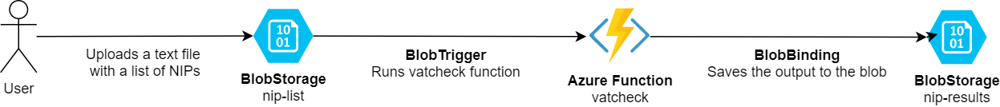
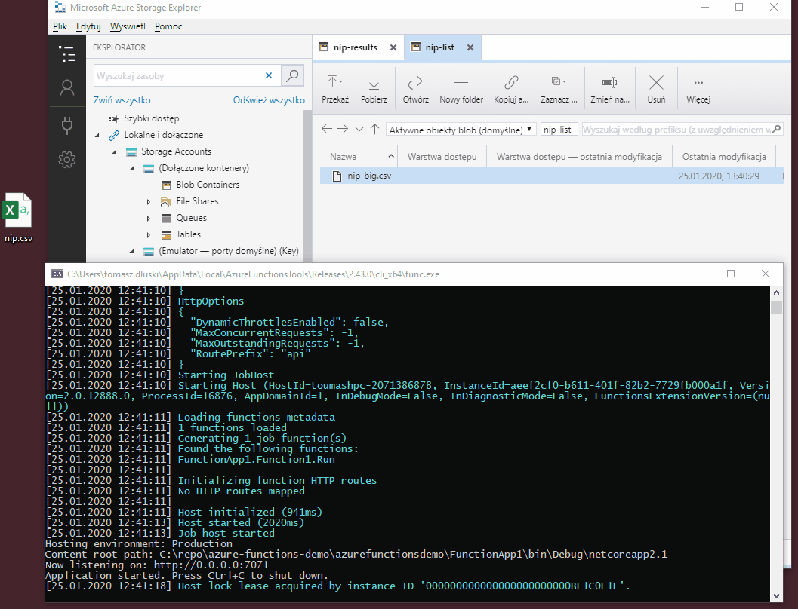

W dniu 8.10.2019 Ministerstwo Finansów opublikowało nowy endpoint do sprawdzania vatu. Jest w to końcu skok w dobrą stronę - w kierunku nowych technologii, ale także nie bez przyczyny.

## Co się zmienia?

Zmienia się typ webserwisu. Ministerstwo przepisało webserwis vatcheck z usługi SOAP (z plikiem wsdl) na aplikację REST (bez pliku schematu).

## Co ze stroną biznesową?

Biznesowo powstał kolejny dodatek - każda firma po dniu 1 stycznia 2020 roku ma **obowiązek** sprawdzać każdy podmiot i jego rachunek bankowy w momencie opłacania faktury. 

## O co chodzi?

Chodzi o status płatnika VATu. Jeśli wyślemy przelew **powyżej 15 000,00 zł** na rachunek nieistniejący w bazie danych ministerstwa nie będziemy mogli wpisać tej transakcji w koszty.

Ok, po tym przydługim wstępnie moge w końcu przejść do rozwiązania.

Aktualnie ministerstwo wspomina na [swojej stronie](https://www.gov.pl/web/kas/api-wykazu-podatnikow-vat) że liczba zapytań ograniczona jest do 30.
> Korzystanie z API jest limitowane. Przy wykorzystaniu metody „search” możesz złożyć 10 zapytań o maksymalnie 30 podmiotów jednocześnie, natomiast przy wykorzystaniu metody „check” możesz zapytać o 1 podmiot. Po wyczerpaniu tego limitu dostęp do API będzie zablokowany do godziny 0:00.

---

## Architektura rozwiązania

Poniżej przyjrzyjmy się przykładowej implementacji opartej o Microsoft Azure. Wykorzystujemy tutaj darmowe dla wszystkich **Azure Functions**, które przechwytują od użytkownika plik z listą NIPów do sprawdzenia, a następnie kolejkowana jest praca sprawdzająca - tutaj już napisana funkcja azure dokonuje sprawdzenia statusu płatnika VAT oraz kont bankowych dla podanych nipów. Wynik takiej operacji wstawiany jest do drugiego kontenera blob o nazwie `results`.

## Kod
[**github.com/toumash/vat-white-list**](https://github.com/Toumash/vat-white-list)

## Demo

